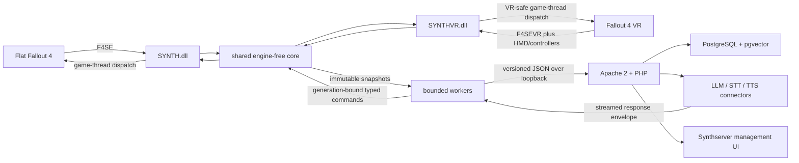

# SYNTH program plan

> **Historical plan (2026-08-30).** Kept for design rationale. Status, branches, runtimes and
> open work are current only in [HANDOFF.md](HANDOFF.md) (2026-10-06).

Research refreshed: 2026-08-30

## Outcome

Create a Fallout 4 sibling to CHIM and Dialectic with two independently releasable repositories:

- `SYNTH`: shared native product core plus flat Fallout 4/F4SE and Fallout 4 VR/F4SEVR clients,
  input, engine state, audio, actions, and independent packaging.
- `Synthserver`: WSL2 Apache/PHP/PostgreSQL backend, AI pipeline, connectors, memory, UI, workers.

The first useful milestone is a complete no-ESP vertical slice in both runtime lanes. A player
targets a Fallout 4 NPC by crosshair or VR HMD/controller ray, submits typed or microphone input,
the correct native plugin sends a strict request to Synthserver, the server produces a mocked or
real model response, and the plugin queues observable text/audio for the correct actor. Save/load
or a new request invalidates stale work.

## Evidence baselines

| System | Repository and inspected commit | Why it matters |
| --- | --- | --- |
| Fallout NV client | `Dwemer-Dynamics/Dialectic@eddbdc77a8347128b5cf5bcd68df0c2404fbf074` | Closest game/client feature baseline and native-runtime invariants. |
| Fallout NV server | `Dwemer-Dynamics/DialecticServer@f447a9c6b59bfc689c788fb0139a0d13c6c6dc51` | Closest backend, database, connector, memory, UI, and test baseline. |
| Skyrim client | `Dwemer-Dynamics/CHIM@165b21c11f5005ca270f4711bc1c3b8770571902` | Current mature runtime, spatial, input, audio, action, and lifecycle behavior reference. |
| Skyrim server | `Dwemer-Dynamics/HerikaServer@3a5b79e262c2a9256fa8af1c67fa0205dd23e7d9` | Current PHP, PostgreSQL, provider, memory, worker, and management-UI baseline. |
| FNV ESP example | `Dwemer-Dynamics/DIALECTIC-HERIKA@327bb99a5ff95f1dd835cfe8e049598c3736172d` | Shows why game records and package forms are a separate deliverable. It is not copied into SYNTH. |
| F4SE | `ianpatt/f4se@cb39721a8155b0ec31640291f2997fa1c43474af` | Official plugin interfaces and runtime compatibility declarations. |
| CommonLibF4 | `libxse/commonlibf4@6266ecc9014b473fc6b6efd04abac324477c63cd` | Pinned C++ engine/F4SE build-time layer with runtime `1.11.240` declarations. |
| CommonLibF4VR | `ArthurHub/CommonLibF4VR@1c7b4fc860261eabad9f044e336965c26abe8ee6` | VR-specific CommonLib/F4SEVR build-time lane. |
| VR Address Library | `alandtse/fallout_vr_address_library@v1.13.1` | VR relocation database required by the planned VR dependency lane. |
| FRIK | `rollingrock/Fallout-4-VR-Body@81239d99663bde447480b8098c1b400ef250d798` | Current optional VR-body/API and build-pattern compatibility reference. |

The repository-role, installation, bootstrap, event, prompt, response, TTS, action-result,
persistence, worker and management-UI flows behind these baselines are documented in
`REFERENCE-STACK-DATAFLOW.md`. That walkthrough is required context for implementation: parity is
measured against the end-to-end behaviors and ownership boundaries, not by copying similarly named
files.

## Product principles

1. Native-first: no FNV-style temporary-file bridge and no Papyrus polling loop for core runtime.
2. Game-thread ownership: copy immutable state, then do network/media work off-thread.
3. Generation safety: save/load/new game/main menu invalidates every stale request and action.
4. Strict contracts: versioned JSON envelopes, size limits, request IDs, runtime generation, form
   identity, action allowlists, and deterministic error results.
5. Local-first: game and WSL communicate over loopback by default; no externally exposed Apache.
6. Server parity without game-name leakage: rename schemas and replace Mojave/Courier/FNV records
   with Commonwealth/Sole Survivor/FO4 data rather than leaving compatibility aliases forever.
7. Measurable completion: CI proves compilation and protocol behavior; Windows in-game matrices
   prove engine behavior. Neither substitutes for the other.
8. First-class VR: share engine-free logic, but use a distinct F4SEVR adapter/artifact and require
   independent HMD/controller/performance/compatibility proof rather than inheriting flat results.

## Architecture

## Runtime support decision

The flat build targets one current Steam/GOG runtime lane and refuses all others. The 2026-08-31
Windows setup verified Steam `Fallout4.exe` `1.11.240.0`; the matching official F4SE build is
`0.7.9`. The setup must still record the F4SE loader/core filenames, hashes, F4SE log, and plugin
load result before in-game support is claimed.

Fallout 4 VR is a simultaneous separate target: Steam runtime `1.2.72`, F4SEVR `0.6.21`, VR
Address Library, and pinned CommonLibF4VR. It produces `SYNTHVR.dll`; it does not reuse the flat
DLL or assume flat addresses/layouts. Execute `FALLOUT4-VR-PLAN.md` for HMD/controller/UI,
performance, popular mod-stack compatibility, packaging, and independent in-headset proof.

Legacy flat `1.10.984`/F4SE `0.7.2` and `1.10.163`/F4SE `0.6.23` are separate future lanes. Do not set
version-independence flags unless the plugin truly uses a compatible Address Library and structure
layout. Microsoft Store/Game Pass, Epic, and consoles remain out of scope.

## Workstreams and gates

### Phase 0: reproducible foundations

- Record a reference-to-target component map from `REFERENCE-STACK-DATAFLOW.md`, including each
  component's owner, ingress/egress contract and preserve/redesign/exclude decision.
- Create an engine-free core; pin CommonLibF4 and CommonLibF4VR/VR Address Library; define original
  build rules; create flat and VR x64 Debug/Release targets, warnings policy, formatting, unit-test
  targets, independent package manifests, and Windows CI.
- Define `synth.*.v1` schemas and shared fixtures in both repositories.
- Add a fake Synthserver and no-game tests.

Gate: a clean Windows runner builds/tests/packages both targets twice with identical tracked
package contents and proves that neither archive contains the other runtime's DLL/dependencies.

### Phase 1: health vertical slice

- Target-specific load/version declaration, shared log/INI, F4SE/F4SEVR messaging, generation,
  task manager, dispatcher, HMD/controller fake snapshots, and capability negotiation.
- Synthserver health/config/database bootstrap and mock connector.
- Init and text request round trip with strict IDs, timeout, cancellation, and diagnostics.

Gate: fake-server E2E passes for both runtime variants; later corresponding Windows game loads show
one plugin load and one init with no background thread touching engine/HMD/controller state.

### Phase 2: dialogue and media

- Flat crosshair plus VR HMD-gaze/controller-ray target, manual/automatic activation, conversation
  ownership, and group audience.
- Text input, flat hotkey or semantic VR push-to-talk, optional open mic, STT upload, NDJSON stream.
- TTS queue, local cache, XAudio2/engine playback decision, 3D positioning, interruption,
  flat/HMD listener positioning, runtime-appropriate subtitles, facing, lipsync, and hard stop.

Gate: deterministic queue/cancellation tests; separate flat and in-headset VR matrices for
menu/combat/save/cell changes, room-scale/seated/handedness, and optional FRIK present/absent.

### Phase 3: world awareness and memory

- Player/world/time/weather/location, nearby actors, condition/activity, equipment/inventory,
  nearby items/doors/POIs, active quests, loaded plugins, factions, dialogue capture.
- Server event log, long/middle-term memory, relationships, dynamic profiles, narrator, diary,
  world knowledge, playthrough snapshots/rollback.

Gate: schema fixtures and server tests, followed by flat and VR in-game comparison captures with
bounded size and frame time; VR uses HMD-effective position and its own scan budgets.

### Phase 4: native actions

- Port the applicable Dialectic action catalog with authoritative speaker/target identity,
  game-thread dispatch, exact completion, timeout, halt, and result events.
- Start with inspect/read-only actions, then inventory, movement/follow, combat, and trade.
- Anything requiring package, quest, faction, keyword, dialogue, or alias forms remains disabled
  until the ESP phase.

Gate: allowlist/unit/fake-runtime proof plus separate flat and VR action-by-action Windows matrices.
No generic console command execution and no arbitrary script proxy.

### Phase 5: management, packaging, and hardening

- Complete Quickstart/configuration, profiles, prompt/action editor, request/response logs,
  memory/world-knowledge/relationship/playthrough pages, health, backups, and worker supervision.
- Release audits, schema migrations, redaction scan, diagnostics bundle, package zip/checksums,
  upgrade/rollback documentation, runtime-lane/capability display, and VR compatibility evidence.

Gate: all non-game rows proven; exact artifact ready for Windows acceptance.

### Phase 6: deferred ESP

Execute `ESP-DEFERRED-SETUP.md` only after native limits are known. Keep core operation independent
of the ESP; use it only for forms and game systems that cannot be created safely by the DLL.

## Completion model

Each requirement is one of:

- `AUTOMATED`: implementation plus no-game automated evidence exists.
- `WINDOWS BUILD PROVEN`: exact source builds/packages on Windows.
- `CAPABILITY DISABLED`: the unsupported behavior is absent from negotiation and model-visible actions.
- `APPROVAL REQUIRED`: implementation would add an unapproved content file, runtime hook, or external integration.
- `IN-GAME PROVEN`: exact artifact passed its flat Fallout matrix.
- `VR IN-GAME PROVEN`: exact VR artifact passed its in-headset and compatibility-profile matrix.
- `DEFERRED ESP`: explicitly excluded from the initial run with setup instructions.

The source run is locally complete when every row is implemented or has a concrete capability or
approval gate, all non-game validation passes, and both Windows build rows are proven. The product
is functional for a runtime only after that runtime's required in-game rows are proven; flat
completion never implies VR completion.

## Risks

| Risk | Control |
| --- | --- |
| Fallout runtime/F4SE churn | One primary runtime, exact version declaration, dependency pin, fail closed, Windows canary. |
| Frozen VR ABI diverges from flat | Separate CommonLibF4VR/F4SEVR adapter, artifact and package; no shared RE/REL types. |
| Incorrect engine-thread access | One selected adapter, immutable snapshots, dispatcher assertions, stress tests. |
| VR player root differs from perception | HMD-effective transforms with freshness; no silent flat-position fallback. |
| Popular VR stacks conflict with hooks/UI | Minimal, FRIK, Idle Hands, Wabbajack and conservative-profile acceptance lanes. |
| GPL/LGPL optional VR integrations | Reference only until explicit license review; core supports no-integration fallback. |
| Stale response mutates a new save | Runtime generation on every unit of work; cancellation and rejection tests. |
| Dialectic code assumes 32-bit FNV/xNVSE | Port behavior, not ABI or offsets; use FO4 types and x64 tests. |
| ESP absence blocks some actions | Capability table and explicit disabled results; defer forms rather than simulate success. |
| Private source vs F4SE release terms | Keep development private; perform the documented source-publication/license review before distribution. |
| PHP fork retains FNV names/data | Rename audit and release-tree forbidden-pattern checks. |
| WSL service writes into Git checkout | Runtime directories/config outside tracked source; least-privilege Apache/service ownership. |
| No local game on this Mac | Windows CI for build; later dedicated Windows acceptance with exact artifact and logs. |

## Research sources

- F4SE downloads and runtime table: https://f4se.silverlock.org/
- F4SE source, build, plugin API, and readme: https://github.com/ianpatt/f4se
- CommonLibF4: https://github.com/libxse/commonlibf4
- CommonLibF4 template reference: https://github.com/libxse/commonlibf4-template
- CommonLibF4VR: https://github.com/ArthurHub/CommonLibF4VR
- VR Address Library and audit tools:
  https://github.com/alandtse/fallout_vr_address_library,
  https://github.com/alandtse/vr_address_tools
- FRIK and Fallout4 VR Tools:
  https://github.com/rollingrock/Fallout-4-VR-Body,
  https://github.com/lfrazer/FO4VRTools
- Popular setup references:
  https://github.com/Moyse06/MadGodsOverhaul,
  https://github.com/FWDekker/fo4vr-modlist,
  https://github.com/wabbajack-tools/mod-lists
- Bethesda Creation Kit availability: https://help.bethesda.net/app/answers/detail/a_id/55366/
- Microsoft WSL install, systemd, and networking:
  https://learn.microsoft.com/windows/wsl/install,
  https://learn.microsoft.com/windows/wsl/systemd,
  https://learn.microsoft.com/windows/wsl/networking
- Ubuntu Apache/PHP setup: https://ubuntu.com/server/docs/how-to/web-services/install-php/
- PostgreSQL Ubuntu packages: https://www.postgresql.org/download/linux/ubuntu/
- pgvector: https://github.com/pgvector/pgvector
