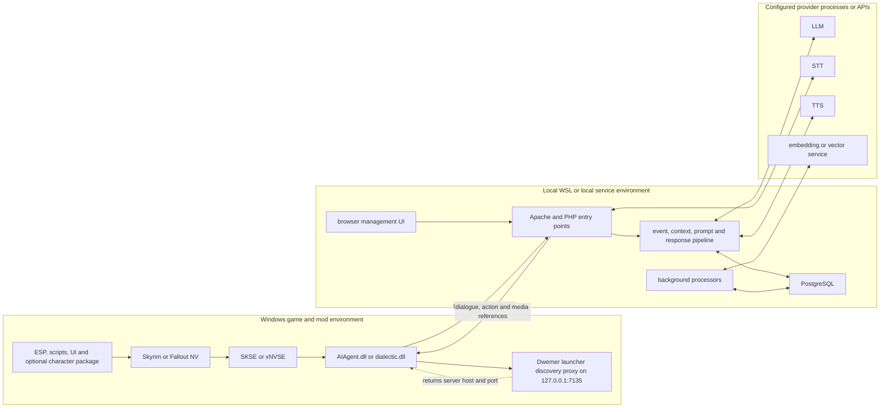
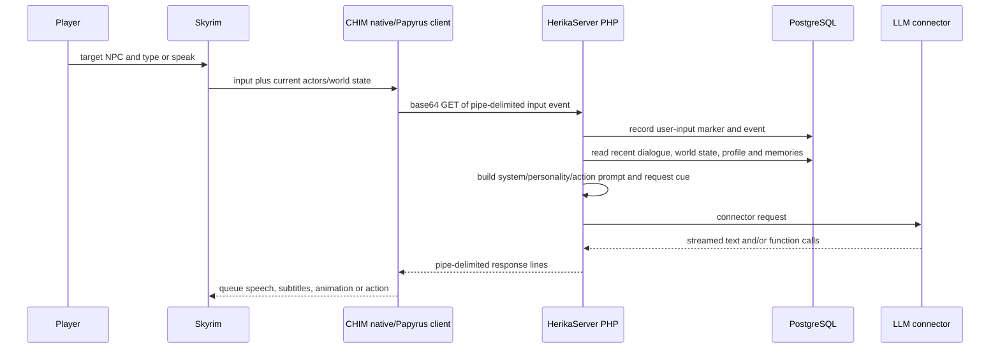
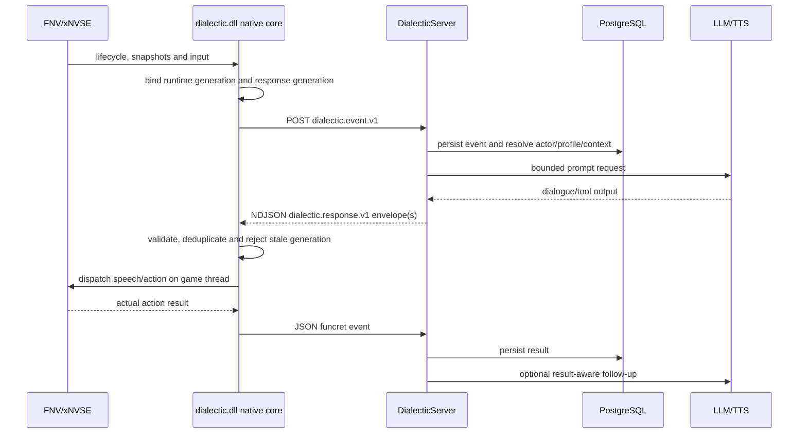

# CHIM, HerikaServer, and Dialectic reference stack

> **Historical research (2026-07-18).** Describes the CHIM/HerikaServer/Dialectic reference
> stack, not SYNTH's current setup. See [HANDOFF.md](HANDOFF.md) and the README (2026-10-06).

Research date: 2026-07-18

This document explains how the inspected Dwemer Dynamics stack is installed, which process owns
each responsibility, and how data moves from the game to the AI providers and back. It is the
architectural bridge between the reference repositories and the SYNTH/Synthserver plans. The goal
is behavioral parity with a cleaner Fallout 4 boundary, not a line-for-line port of legacy code.

## Pinned reference systems

| Role | Repository and inspected commit | What it contains |
| --- | --- | --- |
| Skyrim client | `Dwemer-Dynamics/CHIM@77c73ffb6bb32c226340bbda93b3aac5a7ad49f8` | `AIAgent/` game assets, ESP, Papyrus, PrismaUI and `Plugin/` native SKSE source for `AIAgent.dll`. |
| Skyrim character package | `Dwemer-Dynamics/CHIM-Herika@8be628413ecb2cf05ea0d918c3a48e6717e3d171` | Deployable Herika ESP and compiled Papyrus content. It is content layered on the client, not the AI server. |
| Skyrim server lineage | `abeiro/HerikaServer@0dbfa3eb4d3197d8159b5ff2c77bfdb5bf98b4d0` | Apache/PHP/PostgreSQL bridge, prompt pipeline, providers, memory, media and configuration UI. |
| Fallout NV client | `Dwemer-Dynamics/Dialectic@eddbdc77a8347128b5cf5bcd68df0c2404fbf074` | Native xNVSE client plus ESP, MCM, JIP bridge scripts, UI and deployable data. |
| Fallout NV server | `Dwemer-Dynamics/DialecticServer@f447a9c6b59bfc689c788fb0139a0d13c6c6dc51` | JSON evolution of the HerikaServer pipeline, Fallout-specific persistence, profiles, workers and management UI. |
| Fallout NV character package | `Dwemer-Dynamics/DIALECTIC-HERIKA@327bb99a5ff95f1dd835cfe8e049598c3736172d` | Herika follower ESP, packages, biography import and voice assets for FNV/TTW. It is an integration example, not a runtime dependency. |

The client and server repositories are paired products. `CHIM-Herika` and `DIALECTIC-HERIKA`
demonstrate optional authored character content. Neither package is the service that calls an LLM.

## Reference deployment topology



### Windows side

1. The script extender loads the native DLL into the game process.
2. The deployable mod supplies the game-specific records and script/UI surface that the native DLL
   cannot or should not create. CHIM has substantial Papyrus and PrismaUI content. Dialectic has an
   ESP, MCM, UI XML and JIP-run scripts.
3. A launcher may expose `GET /discover` on loopback port `7135`. CHIM asks for an unqualified
   endpoint; Dialectic tries product aliases such as `dialectic`, `fallout`, `fnv` and `newvegas`.
   The body is `HOST:PORT`. Dialectic also rejects an endpoint it cannot reach.
4. A machine-local INI can override discovery. CHIM reads `Data/SKSE/Plugins/AIAgent.ini` and
   otherwise falls back to `127.0.0.1:8081`. Dialectic preserves shipped defaults in
   `dialectic.ini`, user overrides in `dialectic_custom.ini`, and otherwise falls back to
   `127.0.0.1:8085/DialecticServer/main.php`.

Discovery only answers where the service is. It does not move the AI pipeline into the game or
make the launcher the source of gameplay state.

### Server side

1. Apache routes the plugin request to PHP. HerikaServer exposes several historical entry points,
   including `comm.php`, `stream.php`, `streamv2.php`, `main.php`, `stt.php` and game-data helpers.
   Dialectic consolidates normal game traffic on JSON `main.php` and keeps purpose-specific routes
   for STT, game data, health and management APIs.
2. Runtime bootstrap loads local configuration, opens PostgreSQL, loads general/provider/profile
   settings, verifies migrations and assigns a request ID.
3. The Quickstart/management UI writes the local connector and profile configuration required for
   first use. Provider keys remain a server concern; they are not sent to the game client.
4. Long-running work is separated from the request path. DialecticServer starts or probes its own
   background service on heartbeat port `12347`; current service processors include middle-term
   memory and rolemaster work, with relationship processing in a separate worker.

## How CHIM and HerikaServer move data

CHIM is the mature feature reference, but its wire format is legacy. The important reusable part is
the event vocabulary and lifecycle, not the encoding.

### Client initialization and context maintenance

- `Plugin/Plugin.cpp` installs SKSE listeners/hooks and starts the client managers.
- The native plugin and Papyrus layer discover actors, player/location state, nearby items,
  equipment, quests, dialogue and gameplay events.
- Context is sent as many typed semantic events such as `init`, `playerinfo`, `infoloc`, `infonpc`,
  `infoitems`, `chat`, `location`, `combatbark`, `itemfound` and `_speech`.
- CHIM serializes those events as `type|ts|gamets|payload`, base64-encodes the string and places it
  in a GET query. Profile selection is conveyed by an MD5 name identifier.
- Non-generative context updates use the normal communication path. Events expected to produce
  speech use `stream.php`/`streamv2.php`, derived from the configured `comm.php` path.

HerikaServer decodes the request, splits the tuple, loads the selected character profile, and
routes fast state-only events through `processor/comm.php`. Events that need a model response
continue through the prompt pipeline.

### Player turn and prompt assembly



In `main.php`, HerikaServer:

1. loads configuration, data helpers and extensions;
2. decodes the event and selects the profile;
3. writes an early `user_input` marker so older work can notice a newer player turn;
4. serializes generative work with a semaphore while allowing selected fast context events through;
5. loads prompt definitions and function catalogs;
6. combines system/personality/action instructions, world context, recent event history, optional
   memory injection and the current request cue;
7. selects the configured connector and invokes `call_llm()`;
8. converts model output to response lines and TTS artifacts; and
9. persists event, speech, request/response and memory-related records before post-processing.

The event log is the shared narrative timeline. It is populated by the game and AI responses, then
read back into later prompts. Separate tables hold speech, memories/summaries, diary, quests,
profiles/templates, world knowledge and audit data.

### Response, speech and action return

- HerikaServer emits line-oriented records such as `speaker|action|payload` and terminates the
  logical response with `X-CUSTOM-CLOSE`.
- `Plugin/HTTPManager.cpp` reads the stream off the game thread and places decoded records in
  `SPGResponse` queues keyed by action/channel.
- `Plugin/Plugin.cpp` and `SpeakManager.cpp` drain those queues, resolve the actor, obtain audio,
  show subtitles, animate lips/facial state and schedule game work on the appropriate thread.
- An action request is executed by the client because only the client owns live game objects.
  Its structured result is returned as a `funcret` event. `processor/funcret.php` adds the tool call
  and result to model context and can request a follow-up line or action.
- Interrupt/halt paths cancel queued HTTP/speech work and stop actor behavior.

This feedback loop is essential: server proposes an allowlisted intent, client executes it against
authoritative game state, and server reasons over the actual result. The server must never assume
that proposing an action means it succeeded.

## What Dialectic changed

Dialectic and DialecticServer are the closer architectural baseline for SYNTH. They retain the
Herika event/prompt/memory model while making the runtime and transport boundaries more explicit.

### Native versus script ownership

- `dialectic.dll` owns the frame pump, target/agent state, task manager, transport, response queue,
  speech, audio, most presentation, game-state capture, dialogue guard and action coordination.
- `ln_DialecticBootstrap.txt` is run once per new/loaded save by JIP LN. It validates xNVSE/JIP/
  JohnnyGuitar versions, registers event handlers and starts only the script adapters still needed
  for data or game operations not safely owned by the DLL.
- The bootstrap explicitly does not start retired permanent file pollers for native-authoritative
  presentation, game-state, dialogue-guard and tool-menu paths.
- Some temporary-file adapters remain for FNV script-only or fallback behavior. They are a game-
  specific compatibility layer, not a design target for Fallout 4.

### Versioned JSON request boundary

The client posts a structured event to `DialecticServer/main.php`:

```json
{
  "schema": "dialectic.event.v1",
  "type": "inputtext",
  "ts": 0,
  "gamets": 0,
  "game": "fnv",
  "payload": {},
  "audience_snapshot": {}
}
```

The exact payload varies by event. Player input may carry player and target identity, text, profile
fields, private/group audience data and a request ID. `lib/request.php` rejects malformed JSON,
normalizes the event, and adapts the structured payload to the inherited internal event pipeline.
This compatibility adapter let Dialectic improve the external contract without rewriting the
entire HerikaServer-derived prompt engine at once.

For a generative turn, the client requests NDJSON using `Accept: application/x-ndjson` and
`X-Dialectic-Stream: 1`. Non-generative events use ordinary JSON. All HTTP work is queued outside
the game frame, bounded by timeouts and cancellation tokens.

### Turn correlation and cancellation



- `HTTPManager` binds queued requests to a response generation. Save/load, halt or a superseding
  turn advances the generation and interrupts outstanding WinHTTP work.
- `lib/response.php` emits a request-correlated envelope with `lines` and `close`. A dialogue line
  can include speaker, `action=say`, subtitle text, `utterance_id`, `request_id`, and
  `tts_cache_key`. Command lines use a typed action and metadata.
- `ResponseRouter` parses only JSON envelopes, resolves speaker identity, strips presentation
  metadata, deduplicates utterances and separates dialogue from action lines.
- `ResponseQueueFNV` checks both response and runtime generations before enqueue and again before
  dispatch. Stale dialogue and actions are dropped rather than applied to a different save/turn.
- `SpeakManager` and `AudioManager` serialize speech/presentation. Actions enter `ActionManager`
  only through the typed response queue and return explicit completion/failure results.

### Server pipeline and background state

`main.php` performs logging and worker self-healing, then invokes
`main_dialectic_pipeline.php`. That pipeline:

1. bootstraps config, PostgreSQL, providers, player/narrator/profile state and request logging;
2. decodes one strict JSON event and decides whether streaming was requested;
3. handles state-only events immediately or obtains the main-turn semaphore;
4. binds the intended NPC/profile using target data rather than a caller-selected config file;
5. persists the event and reads world, audience, conversation, relationship and memory context;
6. builds the prompt/function catalog and calls the selected connector;
7. buffers validated response lines, generates or references TTS, and emits JSON/NDJSON;
8. persists speech, response and audit data; and
9. schedules post-request memory, relationship, scene and profile work outside the critical turn.

The current database baseline includes event and response logs, speech, action issuance, memory and
summaries, profiles, prompts, locations, quests, world knowledge, relationships and playthrough
metadata. The management UI exposes Quickstart, connector/profile configuration, prompts/actions,
event/request/response inspection, queue state, memory, world knowledge, relationships,
playthrough management, statistics and audit pages.

## Content packages are a separate layer

`CHIM-Herika` and `DIALECTIC-HERIKA` show how a named follower can add authored records, packages,
aliases, scripts, biography imports and voice assets. They do not define the general AI transport
or server lifecycle.

SYNTH deliberately starts without an ESP. Do not copy either Herika package, compiled scripts,
voice files, Bethesda-derived records or FNV bytecode. If Fallout 4 later needs persistent quests,
aliases, factions, packages, keywords, holotape UI or dialogue records, add an original
`SYNTH.esp` through `ESP-DEFERRED-SETUP.md` as a capability layer. Core target/input/context/
transport/dialogue behavior remains native.

## Ownership model for SYNTH and Synthserver

| Concern | Reference owner | SYNTH owner | Synthserver owner |
| --- | --- | --- | --- |
| Live actor/form/menu/save state | native client plus game scripts | selected flat or VR runtime adapter | never authoritative |
| HMD/controller state | CHIM VR native paths | VR adapter only | capability metadata only |
| Frame pump and game-thread calls | native client | runtime adapter and dispatcher | none |
| Turn/task/generation lifecycle | partial CHIM queues; explicit Dialectic generations | shared native core | request/job deadlines and audit status |
| Event schema and validation | legacy tuple in CHIM; JSON in Dialectic | mirrored `synth.*.v1` fixtures | canonical ingress/egress schemas |
| Actor/action authorization | client resolution plus server function catalog | final form/target/capability validation | propose only allowlisted typed actions |
| Prompt, profile and provider selection | HerikaServer/DialecticServer | send identity/capabilities only | authoritative |
| Narrative timeline and memory | PostgreSQL server | send facts/results | authoritative repositories and workers |
| TTS generation/cache metadata | server with client playback | validate media ID, cache and play | generate/store/serve opaque media |
| Management UI | server | optional in-game status surface only | authoritative local web UI |
| Authored game records | CHIM/Dialectic content packages | deferred original ESP | none |

The selected runtime adapter is the only layer allowed to expose engine types. The shared core owns
immutable snapshots, protocol objects, queues, cancellation and policy. Synthserver never receives
raw pointers, arbitrary local paths or permission to run console/script text.

## Reference-to-SYNTH disposition

| Reference mechanism | Decision | SYNTH/Synthserver replacement |
| --- | --- | --- |
| Rich semantic event vocabulary | Preserve behavior | Typed, bounded `synth.event.v1` payloads with Fallout 4 canonical identity. |
| Pipe-delimited base64 GET transport | Replace | Strict JSON POST and NDJSON stream; body/header/UTF-8/size validation. |
| Name or MD5 as profile identity | Replace | Full form ID, origin plugin/context, save/playthrough ID and explicit server profile ID. |
| Launcher discovery on loopback `7135` | Preserve with validation | Product-specific `synth`/`fo4`/`fo4vr` aliases, reachable-endpoint check, explicit INI override and fallback. |
| Monolithic inherited PHP pipeline | Migrate in stages | Import with provenance, freeze behavior in tests, then separate bootstrap/protocol/pipeline/domain/connectors/repositories. |
| Event log as narrative context | Preserve and constrain | Typed repository, retention/pagination, provenance and bounded prompt selection. |
| Profile/personality/prompt/action editors | Preserve | Fallout 4-aware management UI with secret masking and capability filtering. |
| Server-generated action/function calls | Preserve semantics | Typed allowlisted action objects; client remains final authority and returns exact result. |
| `funcret` action feedback loop | Preserve | Correlated `synth.action.result.v1`, idempotency key, terminal state and optional result-aware follow-up. |
| Response line queue and serialized speech | Preserve | Strict response router, utterance/request dedupe, bounded generation-bound queue. |
| Server/file TTS cache references | Redesign | Opaque same-origin media IDs, verified content type/hash/size, no arbitrary path or URL. |
| Papyrus/JIP permanent polling bridges | Exclude from core | Native F4SE/F4SEVR events and game-thread dispatcher; later ESP scripts only for proven gaps. |
| CHIM PrismaUI and Dialectic MCM | Redesign by surface | Web management stays server-side; native in-game UI is limited to play/status/input needs and has flat/VR adapters. |
| Background memory/relationship workers | Preserve, harden | Typed durable jobs, leases, attempts, idempotency, heartbeat, dead-letter visibility and systemd. |
| Character ESP/PEX/voice packages | Exclude initially | Original optional Fallout 4 content package only after the deferred ESP gate. |

## Required end-to-end SYNTH flows

### Bootstrap and discovery

```mermaid
sequenceDiagram
  participant E as F4SE or F4SEVR
  participant C as SYNTH native client
  participant L as local discovery proxy
  participant S as Synthserver

  E->>C: load exact runtime-specific DLL
  C->>C: validate runtime, load defaults plus local overrides
  C->>L: GET /discover?game=fo4 or fo4vr
  L-->>C: reachable HOST:PORT
  C->>S: synth.init.v1 with versions, runtime_variant and capabilities
  S-->>C: compatibility and health response
  C->>C: store no secrets; expose sanitized readiness
```

The flat and VR artifacts must fail closed on the wrong runtime. Discovery never overrides an
explicit user endpoint and never accepts an unreachable or malformed address. A fake server proves
the entire path before Fallout 4 is needed.

### Player dialogue turn

1. The runtime adapter captures target, player, audience, save/generation and fresh world snapshots
   on the game thread. VR uses HMD/controller-effective transforms rather than the flat player root.
2. The shared core copies immutable bounded data and queues the turn off-thread.
3. STT, when used, returns text to the same turn before the dialogue request. Provider credentials
   stay on Synthserver unless a deliberately client-local STT implementation is selected.
4. Synthserver validates identity/capabilities, persists the event, selects profile/context/memory,
   builds the prompt and calls a fake or configured model.
5. Each NDJSON response envelope is validated before enqueue. A final close/error envelope always
   terminates the logical turn.
6. The client rejects stale/duplicate/unknown lines, resolves actors from authoritative game state,
   obtains verified media and serializes subtitle/audio/lipsync presentation.

### Action and result turn

1. Synthserver emits an allowlisted action with action ID, request ID, intended actor/target,
   arguments, deadline and required capability.
2. The client intersects server intent with local capabilities and live state, then dispatches a
   typed command on the game thread.
3. Every accepted action reaches exactly one terminal result: succeeded, rejected, unavailable,
   timed out, cancelled or failed. No silent success is allowed.
4. The correlated result is persisted and may cause a result-aware model follow-up. Retries use the
   same idempotency key and cannot repeat a completed side effect.

### Save/load and interruption

Main-menu, new-game, pre-load and post-load transitions advance runtime generation, cancel network/
media/action tasks, clear queues and require a fresh init/context snapshot. A new player turn can
advance the response generation without pretending the whole runtime reloaded. Both generations
are checked before enqueue and before game-thread dispatch.

## Implementation checkpoints for the Azure run

The implementation agent must read this document, both architecture documents and both protocol
documents before importing source. Build vertical slices in this order:

1. **Deployment skeleton:** separate flat/VR packages, config precedence, launcher discovery,
   Synthserver bootstrap/health, mock connectors and redacted diagnostics.
2. **Lifecycle slice:** exact DLL load -> generation-bound `init` -> strict server response ->
   observable client status, with mismatched-runtime and server-loss tests.
3. **Context slice:** player/save/world/target/audience snapshots -> validated event persistence ->
   UI/event-log inspection, including size/backpressure and stale-save tests.
4. **Dialogue slice:** text input -> profile/context/prompt -> fake LLM -> NDJSON dialogue -> client
   queue/subtitle, then add STT and TTS with opaque media IDs.
5. **Action slice:** one read-only inspect action -> game-thread execution -> correlated result ->
   result-aware follow-up. Only then expand the action catalog.
6. **Background slice:** durable memory/relationship/profile jobs, worker crash/retry proof and UI
   visibility without holding the player-turn transaction open.
7. **Parity expansion:** port remaining applicable context, providers, actions and management pages
   row by row from the feature matrices.
8. **Runtime proof:** Windows build/package evidence, then separate flat in-game and VR in-headset
   matrices. Automated protocol proof must not be mislabeled as game proof.

Each slice must include a mirrored schema/fixture, offline fake, failure/cancellation case,
structured evidence and an update to the parity matrix. Preserve reference semantics only when the
new owner, trust boundary and terminal behavior are explicit.

## Source navigation for implementers

Use these files to verify behavior at the pinned commits:

- CHIM client: `Plugin/Conf.cpp`, `Plugin/HTTPManager.cpp`, `Plugin/SPGResponse.cpp`,
  `Plugin/SpeakManager.cpp`, `Plugin/Plugin.cpp`, `Plugin/Papyrus.cpp`, and `AIAgent/`.
- HerikaServer: `main.php`, `stream.php`, `streamv2.php`, `processor/request.php`,
  `processor/comm.php`, `processor/funcret.php`, `processor/postrequest.php`,
  `prompt.includes.php`, `connector/`, `tts/`, `stt/`, `lib/postgresql.class.php`,
  `data/database_default.sql`, and `ui/`.
- Dialectic client: `Plugin/src/main.cpp`, `Config.cpp`, `HTTPManager.cpp`, `GameLoop.cpp`,
  `ResponseRouter.cpp`, `ResponseQueueFNV.cpp`, `SpeakManager.cpp`, `ActionManager.cpp`,
  `XNVSEAdapter.cpp`, and `Mod/Data/NVSE/Plugins/scripts/ln_DialecticBootstrap.txt`.
- DialecticServer: `main.php`, `main_dialectic_pipeline.php`, `lib/runtime_bootstrap.php`,
  `lib/request.php`, `lib/response.php`, `lib/background_processor.php`, `processor/`, `connector/`,
  `tts/`, `stt/`, `service/`, `ext/relationship_system/worker.php`,
  `data/database_default.sql`, `debug/db_updates.php`, and `ui/`.

Do not modify the reference repositories. Any copied server source requires the import/provenance
sequence in the Synthserver migration audit. Port client behavior into original Fallout 4 code;
never carry FNV addresses, ABI types, compiled scripts or game assets into SYNTH.
